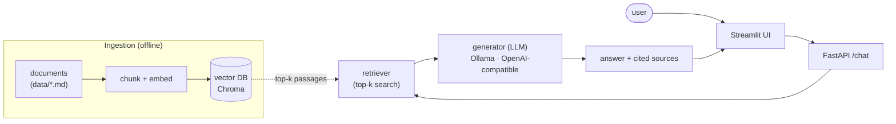

# Relocation Assistant — RAG with Source Citations & Evaluation

[](https://github.com/rasmusfaber-ai/relocation-assistant-rag/actions/workflows/ci.yml)
[](https://www.python.org/downloads/)
[](https://docs.astral.sh/ruff/)
[](LICENSE)

A retrieval-augmented generation (RAG) assistant that answers questions about
relocating to Poland as an EU citizen (PESEL, residence registration, health
insurance, …), grounded in a small **curated knowledge base compiled from
official sources** (gov.pl, ZUS, NFZ, …), and returns the **source passages**
behind every answer.

> The domain is swappable — point `data/` at any document corpus and re-ingest.


> 🔗 **[Live demo »](https://relocation-assistant-rag.streamlit.app/)** — hosted free on
> Streamlit Community Cloud. (Free tier sleeps when idle; the first visit takes a
> few seconds to wake — the screenshot above shows the same flow if the demo is cold.)

<!--
  TODO (demo GIF): record a ~20s screen capture of one question → grounded answer
  with sources, save it as docs/demo.gif, and embed it here in place of / above the
  screenshot. A GIF renders on GitHub even when the live demo is asleep. Suggested:
  1. Run the app locally (see Quickstart), ask e.g. "How do I get a PESEL number?".
  2. Record with ScreenToGif (Windows) or peek/`ffmpeg`; keep it < 5 MB, ≤ 20s.
  3. Replace the screenshot line above with: 
-->

What makes this more than a "chat with your PDF" demo: it ships with a small
**evaluation harness** that measures retrieval quality (hit-rate@k) and enforces
it as a **CI quality gate**, runnable locally and in CI without an API key.
(Built by someone whose M.Sc. thesis was LLM evaluation — so evaluation is
treated as a first-class concern, not an afterthought.) It measures **both**
failure modes of a RAG: retrieval quality (hit-rate@k / hit-rate@1 / MRR) and
**answer groundedness** — whether each answer sentence is backed by a retrieved
passage.

## Architecture



**Components:**

- **Backend:** FastAPI (`/health`, `/ingest`, `/chat`)
- **Embeddings:** `sentence-transformers` (default `all-MiniLM-L6-v2`)
- **Vector store:** Chroma (local, persistent)
- **LLM:** pluggable provider — Ollama (local) or any OpenAI-compatible endpoint
- **Frontend:** Streamlit
- **Quality:** `ruff` + `mypy` + `pytest`, all gated in GitHub Actions CI; evaluation harness in `eval/`
- **Packaging:** Dockerfile + docker-compose

## Quickstart (local)

```bash
# 1. Install
python -m venv .venv && source .venv/bin/activate
pip install -r requirements.txt

# 2. Configure
cp .env.example .env        # edit if you want a different model/provider

# 3. (Option A) Run with Ollama locally
ollama pull llama3.1:8b     # or any model you have
# (Option B) point LLM_PROVIDER=openai at an OpenAI-compatible endpoint in .env

# 4. Ingest the sample documents
python -m app.rag.ingest

# 5. Run the API + UI
uvicorn app.main:app --reload          # http://localhost:8000/docs
streamlit run frontend/streamlit_app.py # http://localhost:8501
```

## Run with Docker

The image's default command is the **single-process demo** — Streamlit calling
the RAG pipeline in-process on port **7860**, the exact setup the live Space runs:

```bash
docker build -t relocation-rag .
docker run -p 7860:7860 --env-file .env relocation-rag   # http://localhost:7860
```

For the full **two-service** setup (FastAPI API + Streamlit UI over HTTP):

```bash
docker compose up --build
# API → http://localhost:8000 , UI → http://localhost:8501
```

## Deployment

The public demo runs free on **Streamlit Community Cloud**, deployed straight from
this GitHub repo: the Streamlit UI calls the RAG pipeline in-process (Groq as the
LLM provider via a stored secret; vector store rebuilt on each cold start). The
repo's `Dockerfile`/`docker-compose.yml` remain for local container use.

To deploy: on [share.streamlit.io](https://share.streamlit.io), create an app from
this repo pointing at `frontend/streamlit_app.py`, and add your LLM-provider
credentials (`OPENAI_API_KEY`, `OPENAI_BASE_URL`, `OPENAI_MODEL`) as app secrets.
The UI auto-selects in-process mode when no `API_URL` is set.

## Evaluation

```bash
python -m app.rag.ingest     # build the vector store first
python -m eval.run_eval      # prints hit-rate@k, hit-rate@1, MRR@k and enforces the gate
```

The harness scores retrieval against an eval set of `(question, expected-source)`
pairs with three metrics:

- **hit-rate@k** — expected document is among the top-k passages (the **CI gate**:
  fails the build below **0.8**).
- **hit-rate@1** — stricter: expected document is the *top-ranked* passage.
- **MRR@k** — mean reciprocal rank of the first correct passage (rewards ranking
  the right document higher, not just having it somewhere in the top-k).

All three run on local embeddings only — no LLM/API key required. On the current
corpus (9 docs, 16 questions) the shipped config scores **hit-rate@4 100%**,
**hit-rate@1 94%**, **MRR@4 0.97**.

### Retrieval decisions, measured

hit-rate@4 alone saturates at 100% here (the documents are topically distinct, so
the right one almost always lands in the top-4). The interesting question is
*ranking* — does the right document come **first**? `eval/sweep.py` sweeps chunk
size against embedding model and reports hit@1 / MRR, which do discriminate:

<!-- generated by: python -m eval.sweep  (see eval/sweep_results.md) -->

| Embedding model | Chunk size | hit@1 | hit@4 | MRR@4 | Chunks |
| --- | ---: | ---: | ---: | ---: | ---: |
| `all-MiniLM-L6-v2` | 400 | 94% | 100% | 0.969 | 40 |
| `all-MiniLM-L6-v2` | 800 | 94% | 100% | 0.969 | 21 |
| `all-MiniLM-L6-v2` | 1200 | 100% | 100% | 1.000 | 15 |
| `bge-small-en-v1.5` | 400 | 100% | 100% | 1.000 | 40 |
| `bge-small-en-v1.5` | 800 | 100% | 100% | 1.000 | 21 |
| `bge-small-en-v1.5` | 1200 | 100% | 100% | 1.000 | 15 |

_16 eval questions; overlap = 15% of chunk size; embeddings L2-normalized, cosine
space; models compared out-of-the-box (no query-side instructions)._

**Reading:** `bge-small-en-v1.5` ranks the correct document first on every question
regardless of chunk size, while the default `all-MiniLM-L6-v2` mis-ranks one
question at the smaller chunk sizes and only reaches hit@1 100% at chunk size 1200.
So the top-1 ranking gap closes either by **upgrading the embedding model** or by
**using larger chunks** — a decision this repo can now *measure* rather than guess.
The default stays MiniLM @ 800 (smallest, fastest, CI-friendly); the table
documents what each knob buys. Re-generate it any time with `python -m eval.sweep`.

### Answer groundedness (faithfulness)

Retrieval metrics ask *"did we fetch the right document?"*. Groundedness asks the
complementary question that matters most for a citation-based assistant: *"does the
generated answer stay within what those passages say — or does the model add claims
of its own?"* A hallucinated detail is most dangerous exactly when sources are
attached, because the answer looks trustworthy.

`eval/groundedness.py` gives a **lightweight, offline proxy**: it generates each
answer, splits it into sentences, and marks a sentence as *supported* when its best
cosine similarity to any retrieved passage clears a threshold. An answer's
groundedness is the fraction of supported sentences.

```bash
python -m eval.groundedness --limit 5    # needs a configured LLM provider
```

Illustrative run (Groq `llama-3.1-8b-instant`): **mean groundedness ≈ 83%**, with
about half the answers fully grounded — enough signal to catch the sentences a
model adds beyond its sources.

**Honest limitations:** this measures *semantic overlap*, not logical entailment —
a sentence that contradicts a passage while reusing its words can still score as
supported, and a correctly-grounded but tersely-worded sentence can dip below the
threshold. It is a cheap, deterministic screen, not a substitute for an NLI /
LLM-as-judge faithfulness model. Because it calls the LLM it runs locally, not as
the API-key-free CI gate (and free-tier rate limits may skip some questions; the
run reports how many).

The evaluation set lives in `eval/eval_set.jsonl` (question / expected-source
pairs). Extend it as you add documents.

## Knowledge base & data provenance

The corpus in `data/` is a small set of plain-language summaries written for this
demo, each **compiled from and attributed to an official Polish/EU source**
(gov.pl, biznes.gov.pl, EURES, and the EU *Your Europe* portal). It is intentionally
small and curated: the focus of the project is the **RAG + evaluation
engineering**, not a complete legal reference.

**Provenance is machine-readable.** Every document carries front matter with the
original source:

```markdown
---
source_name: Your Europe — Your health insurance cover when living abroad
source_url: https://europa.eu/youreurope/citizens/health/when-living-abroad/...
---
```

`ingest.py` strips this block before chunking (so it never pollutes an embedding)
and stores it as chunk metadata, which the retriever returns on every `Source`.
The UI therefore renders each citation as a **link to the official page**, not
just a filename. Documents without a single authoritative source simply omit the
field and render without a link.

Answers are model-generated and **not** legal advice; always verify with the
linked official source.

> **Planned v2:** extend the corpus with a dated snapshot of the real,
> reusably-licensed official pages themselves, so retrieval runs over primary
> text rather than summaries — and the eval set grows with it.

## Project structure

```
relocation-assistant-rag/
├── app/
│   ├── main.py            # FastAPI app & routes
│   ├── config.py          # settings from environment
│   ├── models.py          # request/response schemas
│   └── rag/
│       ├── ingest.py      # load → chunk → embed → store
│       ├── retriever.py   # vector search
│       ├── generator.py   # LLM provider abstraction (Ollama / OpenAI-compatible)
│       └── pipeline.py    # retrieve + generate → answer with sources
├── frontend/streamlit_app.py
├── eval/{run_eval.py, sweep.py, groundedness.py, eval_set.jsonl}
├── data/                  # curated summaries compiled from official sources (.md/.txt)
├── tests/                 # pytest
├── .github/workflows/ci.yml   # tests + retrieval eval gate
├── Dockerfile, docker-compose.yml
├── requirements.txt, .env.example, .gitignore
```

## Roadmap

- [x] MVP: ingest, cited answers, FastAPI + Streamlit, Docker
- [x] Eval harness wired into CI (retrieval hit-rate gate ≥ 0.8)
- [x] Retrieval metrics beyond the gate: hit-rate@1 + MRR, and a chunk-size × embedding-model sweep (`eval/sweep.py`)
- [x] Answer-groundedness (faithfulness) proxy: per-sentence support against retrieved passages (`eval/groundedness.py`)
- [ ] Public deployment (Streamlit Community Cloud) + README screenshots & live link
- [x] Machine-readable provenance: citations link to the official source page
- [ ] v2 corpus: dated snapshot of the real official pages, retrieval over primary text
- [ ] Stretch: agentic clarify-question step, reranking, NLI/LLM-as-judge faithfulness (beyond the embedding proxy)

## Disclaimer

Educational portfolio project. The knowledge base is a small set of curated
summaries compiled from official sources, not the official documents themselves.
Answers are model-generated and **not** legal advice; always verify with the
official source cited in each document.

## License

MIT — see [LICENSE](LICENSE).
