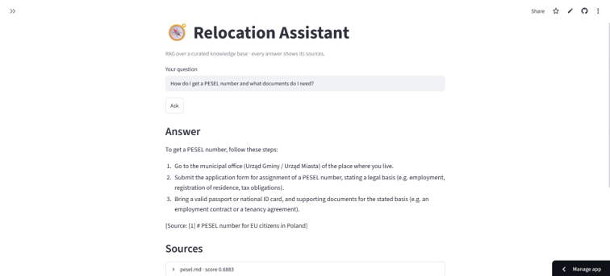

# Relocation Assistant — RAG with Source Citations & Evaluation

A retrieval-augmented generation (RAG) assistant that answers questions about
relocating to Poland as an EU citizen (PESEL, residence registration, health
insurance, …), grounded in a small **curated knowledge base compiled from
official sources** (gov.pl, ZUS, NFZ, …), and returns the **source passages**
behind every answer.

> The domain is swappable — point `data/` at any document corpus and re-ingest.

> 🔗 **[Live demo »](https://relocation-assistant-rag.streamlit.app/)** — hosted free on
> Streamlit Community Cloud. (Free tier sleeps when idle; the first visit takes a
> few seconds to wake.)



What makes this more than a "chat with your PDF" demo: it ships with a small
**evaluation harness** that measures retrieval quality and answer faithfulness,
runnable locally and in CI. (Built by someone whose M.Sc. thesis was LLM
evaluation — so evaluation is treated as a first-class concern, not an
afterthought.)

## Architecture

```
                ┌─────────────┐      ┌──────────────┐
  documents ──▶ │   ingest    │ ──▶  │  vector DB   │
  (data/)       │ chunk+embed │      │  (Chroma)    │
                └─────────────┘      └──────┬───────┘
                                            │ top-k
  user ──▶ Streamlit ──▶ FastAPI /chat ──▶ retriever ──▶ generator (LLM) ──▶ answer + sources
                                                          │
                                             Ollama (local) │ OpenAI-compatible API
```

- **Backend:** FastAPI (`/health`, `/ingest`, `/chat`)
- **Embeddings:** `sentence-transformers` (default `all-MiniLM-L6-v2`)
- **Vector store:** Chroma (local, persistent)
- **LLM:** pluggable provider — Ollama (local) or any OpenAI-compatible endpoint
- **Frontend:** Streamlit
- **Quality:** pytest + GitHub Actions CI; evaluation harness in `eval/`
- **Packaging:** Dockerfile + docker-compose

## Quickstart (local)

```bash
# 1. Install
python -m venv .venv && source .venv/bin/activate
pip install -r requirements.txt

# 2. Configure
cp .env.example .env        # edit if you want a different model/provider

# 3. (Option A) Run with Ollama locally
ollama pull llama3.1:8b     # or any model you have
# (Option B) point LLM_PROVIDER=openai at an OpenAI-compatible endpoint in .env

# 4. Ingest the sample documents
python -m app.rag.ingest

# 5. Run the API + UI
uvicorn app.main:app --reload          # http://localhost:8000/docs
streamlit run frontend/streamlit_app.py # http://localhost:8501
```

## Run with Docker

The image's default command is the **single-process demo** — Streamlit calling
the RAG pipeline in-process on port **7860**, the exact setup the live Space runs:

```bash
docker build -t relocation-rag .
docker run -p 7860:7860 --env-file .env relocation-rag   # http://localhost:7860
```

For the full **two-service** setup (FastAPI API + Streamlit UI over HTTP):

```bash
docker compose up --build
# API → http://localhost:8000 , UI → http://localhost:8501
```

## Deployment

The public demo runs free on **Streamlit Community Cloud**, deployed straight from
this GitHub repo: the Streamlit UI calls the RAG pipeline in-process (Groq as the
LLM provider via a stored secret; vector store rebuilt on each cold start). The
repo's `Dockerfile`/`docker-compose.yml` remain for local container use.

To deploy: on [share.streamlit.io](https://share.streamlit.io), create an app from
this repo pointing at `frontend/streamlit_app.py`, and add your LLM-provider
credentials (`OPENAI_API_KEY`, `OPENAI_BASE_URL`, `OPENAI_MODEL`) as app secrets.
The UI auto-selects in-process mode when no `API_URL` is set.

## Evaluation

```bash
python -m app.rag.ingest     # build the vector store first
python -m eval.run_eval      # prints retrieval hit-rate@k and enforces the gate
```

The harness computes **retrieval hit-rate@k**: the fraction of eval questions
whose expected source document appears among the top-k retrieved passages. It is
wired into CI as a **quality gate** (fails the build below **0.8**), using local
embeddings only — no LLM/API key required. Current corpus (8 docs, 13 questions):
**hit-rate 100%**.

The evaluation set lives in `eval/eval_set.jsonl` (question / expected-source
pairs). Extend it as you add documents.

## Knowledge base & data provenance

The corpus in `data/` is a small set of plain-language summaries written for this
demo, each **compiled from and attributed to official Polish/EU sources**
(gov.pl, obywatel.gov.pl, ZUS, NFZ, …) — see the `Source:` note at the bottom of
every file. It is intentionally small and curated: the focus of the project is
the **RAG + evaluation engineering**, not a complete legal reference. Answers are
model-generated and **not** legal advice; always verify with the source cited in
each document.

> **Planned v2:** swap these summaries for a snapshot of real, reusably-licensed
> official pages (e.g. the EU *Your Europe* portal) and surface the actual source
> **URL** in each citation — turning provenance from a filename into a clickable
> official link.

## Project structure

```
relocation-assistant-rag/
├── app/
│   ├── main.py            # FastAPI app & routes
│   ├── config.py          # settings from environment
│   ├── models.py          # request/response schemas
│   └── rag/
│       ├── ingest.py      # load → chunk → embed → store
│       ├── retriever.py   # vector search
│       ├── generator.py   # LLM provider abstraction (Ollama / OpenAI-compatible)
│       └── pipeline.py    # retrieve + generate → answer with sources
├── frontend/streamlit_app.py
├── eval/{run_eval.py, eval_set.jsonl}
├── data/                  # curated summaries compiled from official sources (.md/.txt)
├── tests/                 # pytest
├── .github/workflows/ci.yml   # tests + retrieval eval gate
├── Dockerfile, docker-compose.yml
├── requirements.txt, .env.example, .gitignore
```

## Roadmap

- [x] MVP: ingest, cited answers, FastAPI + Streamlit, Docker
- [x] Eval harness wired into CI (retrieval hit-rate gate ≥ 0.8)
- [ ] Public deployment (Streamlit Community Cloud) + README screenshots & live link
- [ ] v2 corpus: snapshot of real, reusably-licensed official pages with clickable source-URL citations
- [ ] Stretch: agentic clarify-question step, reranking, answer-faithfulness scoring

## Disclaimer

Educational portfolio project. The knowledge base is a small set of curated
summaries compiled from official sources, not the official documents themselves.
Answers are model-generated and **not** legal advice; always verify with the
official source cited in each document.

## License

MIT — see [LICENSE](LICENSE).
